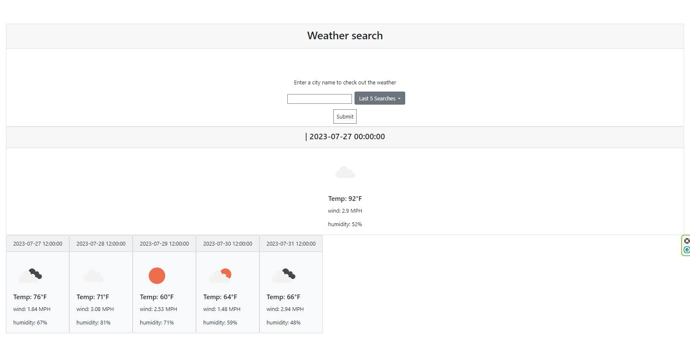

# Work Day Scheduler Starter Code

## Description

This webpage connects with an API to get weather information for the current day, and the following 5 days.

direct link: https://leex3683.github.io/WeatherChecker

## Installation

N/A

## Usage

This page allows the user to input a city name, and check the current and future 5 day weather information. Information for temperature, wind, and humidity is given, as well as an icon matching the conditions.

The user's searches are stored in a drop down called "last 5 searches" for easy reaccess.

Invalid or blank city names will return an alert box prompting the user to enter a valid city name.

## Credits

N/A

## License

See the LICENSE file also contained in this repository

## Badges

N/A

## Features

N/A

## How to Contribute

N/A

## Tests

N/A